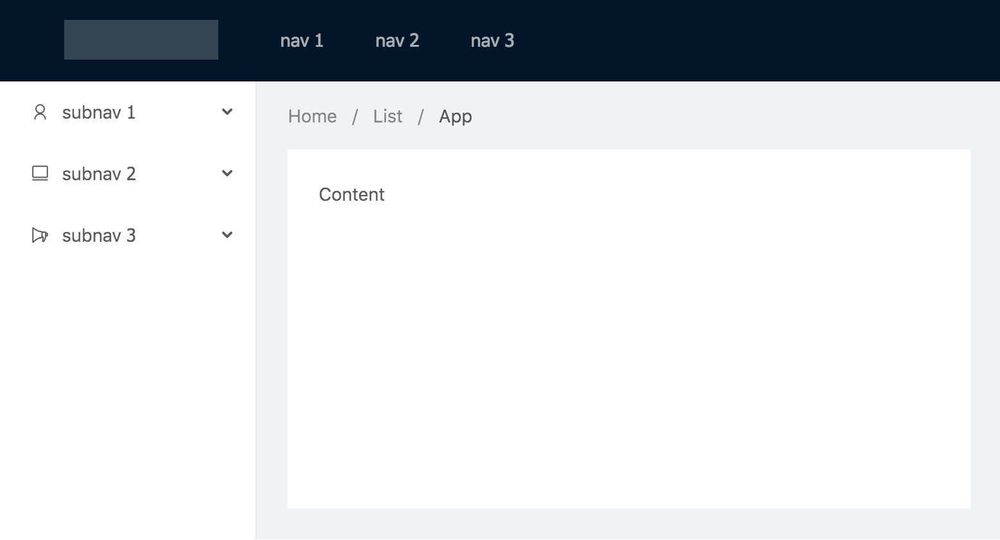
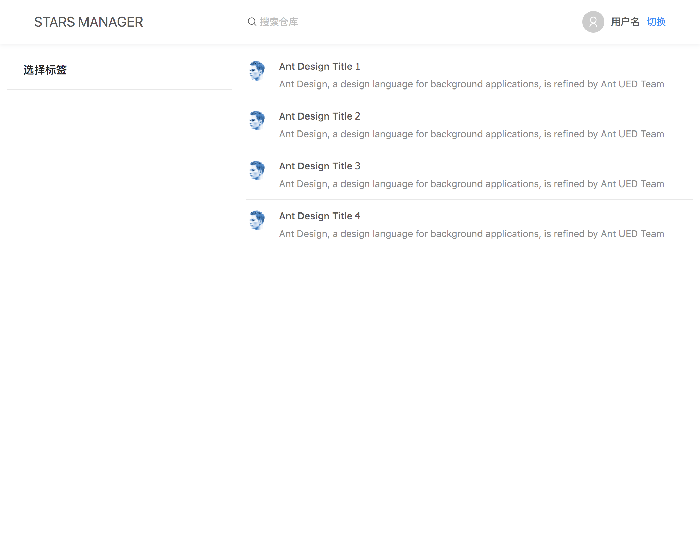

# NG ZORRO ANTD - Github Stars(教程)

## 开始之前

这是一篇介绍 NG-ZORRO 的入门教程，我们会一步一步的带你完成下面的应用。

TODO 最终应用截图


在开始本教程之前，我们需要你具备以下的基础知识：

- 包管理工具 `npm` 或者 `yarn` 的安装及使用方式。
- HTML、CSS 和 JavaScript 的中级知识。
- TypeScript 与 Angular 入门。

## 0 - 初始化项目

首先我们需要安装 [Angular CLI](https://cli.angular.io/) 它使我们不再需要配置繁琐的开发环境。构建、调试、代理、打包部署等一些列操作...

```base
npm install -g @angular/cli
```

新建一个名为 `nz-stars` Angular 项目设置样式扩展名为 `less`，并且生成路由模块。

```base
ng new nz-stars --style=less --routing
```

切换到 nz-stars 目录使用 `ng add `添加 NG-ZORRO。此命令会自动的为你初始化 NG-ZORRO。

```base
cd nz-stars
ng add ng-zorro-antd
```

运行项目, 在浏览器打开 http://localhost:4200

```base
ng serve -o # open your browser on http://localhost:4200/
```

当你在浏览器中看见下面的页面就说明我们可以继续下一步了


## 1 - 布局


这里我们会用 `ng generate` 命令，来快速生成组件。NG-ZORRO 现在有 **300+** 预设模板，你可以在[官网](https://ng.ant.design)中的任何一个组件DEMO中找到对于的命令拷贝按钮。

在命令行中输入下面的命令。

```base
ng g ng-zorro-antd:layout-top-side-2 -p app --styleext='less' --name=layout
```

**发生了什么**？我们使用 NG-ZORRO 提供的 `layout-top-side-2` 模板生成一个叫做 `layout` 的带侧边栏和顶部布局组件。并且为你声明在了 `app.module.ts` 中。

然后我们修改我们的 `app.component.html` 代码，替换成我们生成的 `layout` 组件。

***app.component.html***

```html
<app-layout></app-layout>
```

现在你的应用应该像下面这样。



我们只需要几个简单的命令就可以创建组件，接下来我们只需要在它的基础上进行开发。

## 2 - 添加组件

不管使用什么框架，我们都绕不开组件。很多入门阶段的同学对认为只有需要功能复用才分离成组件，在组件规划上 [关注点分离](https://zh.wikipedia.org/wiki/%E5%85%B3%E6%B3%A8%E7%82%B9%E5%88%86%E7%A6%BB) 应该我们首要考虑的目标。一个复杂的页面上通常包含多个业务逻辑。我们应该根据逻辑的复杂度和业务的关联性来进行组件拆分。这样我们在开发和今后维护时，只需要关注一小部分，而不至于担心其他逻辑。下面我们根据这个原则将来创建项目的组件：

- 用户面板
- 标签筛选
- 搜索框
- 项目列表

### 2-0 打扫新房

让我们清理 `layout` 组件，为接下来的组件腾出位置，之后我们会回来编辑它。

删除多余的 html，并且给每个部分添加 calss，用于调整样式。

**layout.component.html**

```html
<nz-layout class="layout">
  <nz-header class="header">
    <div class="title">Stars Manager</div>
    <div class="search-bar-wrap">
      <!--TODO 搜索框-->
    </div>
    <div class="user-pane-wrap">
      <!--TODO 用户面板-->
    </div>
  </nz-header>
  <nz-layout class="main">
    <nz-sider [nzWidth]="350" class="side">
      <div class="labels-wrap">
        <!--TODO 标签筛选-->
      </div>
    </nz-sider>
    <nz-layout>
      <nz-content class="content">
        <div class="item-list-wrap">
          <!--TODO 项目列表-->
        </div>
      </nz-content>
    </nz-layout>
  </nz-layout>
</nz-layout>
```

**layout.component.less**

```less
@side-width: 350px; // 侧边栏宽度
@header-height: 64px; // 头部高度

.layout {
  width: 100%;
  height: 100%;
}

.header {
  position: fixed;
  z-index: 1;
  display: flex;
  top: 0;
  width: 100%;
  height: @header-height;
  background: #fff;
  box-shadow: 0 2px 8px #f0f1f2;

  .title {
    font-size: 20px;
    text-align: left;
    text-transform: uppercase;
    width: @side-width - 50;
  }

  .search-bar-wrap {
    flex: 1 1 auto;
    padding-right: 36px
  }

  .user-pane-wrap {
    height: 64px;
    max-width: 300px;
  }

}

.main {
  margin-top: @header-height;
  position: relative;

  .side {
    background: #fff;
    border-right: 1px solid #e9e9e9;

    .labels-wrap {
      margin: 10px;
    }
  }

  .content {
    height: 100%;
    overflow: auto;
    background: #fff;

    .item-list-wrap {
      margin: 10px;
    }
  }

}
```

现在你的应用应该是一片空白，没关系，接下来我们来编写每个部分的组件。

### 2-1 用户面板

命令行输入以下命令生成一个空白的组件：

```base
ng g c user-panel # 生成 src/app/user-panel
```

在 `layout` 组件用户面板位置添加如下代码。

**layout.component.html**

```html
...
<div class="user-pane-wrap">
  <app-user-panel></app-user-panel>
</div>
...
```

接下来我们给组件添加一个 `nz-avatar` 组件用于显示用户头像；一个 class 为 `username` 部分显示用户名；最后添加一个带状态控制的按钮，用于添加或切换用户。

 **user-panel.component.html**
 
```html
<nz-avatar nzIcon="anticon anticon-user"></nz-avatar>
<div class="username">用户名</div>
<div class="add-user">
  <a *ngIf="false">添加用户</a>
  <a>切换</a>
</div>
```

编写样式文件，其中 `:host` 是指当前组件。为了避免用户名过长，我们让它超出隐藏。

 **user-panel.component.less**
 
```less
:host {
  display: flex;
  justify-content: flex-start;
  align-items: center;

  .username {
    margin: 0 10px;
    color: #595959;
    font-weight: 500;
    max-width: 200px;
    overflow: hidden;
    text-overflow: ellipsis;
    white-space: nowrap;
  }
}
```
 
### 2-2 搜索框

然后输入一下命令生成一个带前缀图标以及清除按钮的搜索框组件：

```base
ng g ng-zorro-antd:input-presuffix -p app --styleext='less' --name=search-bar # 生成 src/app/search-bar
```

和之前一样在 `layout` 组件预留的位置中添加该组件。

**layout.component.html**

```html
...
<div class="search-bar-wrap">
  <app-search-bar></app-search-bar>
</div>
...
```

接下来我们修改一下前缀图标及默认文字。

这里我们的 `ngModel` 使用单向绑定，手动的处理 `(ngModelChange)` 以便向外发出搜索事件。

**search-bar.component.html**

```html
<nz-input-group [nzSuffix]="suffixTemplate" nzPrefixIcon="anticon anticon-search">
  <input class="search-input" type="text" nz-input placeholder="搜索仓库" [nzSize]="'large'" [ngModel]="term" (ngModelChange)="onSearch($event)">
</nz-input-group>
<ng-template #suffixTemplate><i class="anticon anticon-close-circle" (click)="onClear()" *ngIf="term"></i>
</ng-template>
```

在 ts 文件中添加处理搜索和清除的对应代码。

**search-bar.component.ts**

我们使用 `@Output` 声明两个输出事件，用于与父组件通讯。

```ts
import { Component, EventEmitter, Output } from '@angular/core';

@Component({
  selector: 'app-search-bar',
  templateUrl: './search-bar.component.html',
  styleUrls: ['./search-bar.component.less']
})
export class SearchBarComponent {
  term: string;

  @Output() search = new EventEmitter<string>();
  @Output() clear = new EventEmitter<void>();

  onClear(): void{
    this.term = null;
    this.clear.emit()
  }

  onSearch(value: string): void {
    this.term = value;
    this.search.emit(value);
  }
}
```

然后我们修改输入框的默认样式，去掉边框。

**search-bar.component.less**

```less
.search-input {
  border: none;
  &:focus {
    box-shadow: none;
  }
}

.anticon-close-circle {
  cursor: pointer;
  color: #ccc;
  transition: color 0.3s;
  font-size: 12px;
}

.anticon-close-circle:hover {
  color: #999;
}

.anticon-close-circle:active {
  color: #666;
}
```

现在我们的头部应该像下面这样


我们的头部组件已经完成，下面我们来编写侧边栏的标签筛选组件。

### 2-3 标签筛选

在命令行输入一下命令，生成一个可选标签组件：

```base
ng g ng-zorro-antd:tag-hot-tags -p app --styleext='less' --name=labels-filter
```

将生成的组件放在侧边栏的位置

**layout.component.html**

```html
<nz-sider [nzWidth]="350" class="side">
  <div class="tags-wrap">
    <app-labels-filter></app-labels-filter>
  </div>
</nz-sider>
```


接下来我们将 html 内容放入一个 `nz-card` 组件中。

`nz-card` 是一个卡片容器组件，允许我们设置标题、操作按钮以及内容。

**labels-filter.component.html**

```html
<nz-card [nzBordered]="false" nzTitle="选择标签">
  <nz-tag *ngFor="let tag of hotTags" nzMode="checkable"
          [nzChecked]="selectedTags.indexOf(tag) > -1" (nzCheckedChange)="handleChange($event, tag)">
    {{ tag }}
  </nz-tag>
</nz-card>
```

现在刷新你的页面，你会看到下面的样子


现在试着修改一下 `ts` 文件里的 `tagsFromServer` 变量，为他多增减几个标签。你会发现样式显得有些拥挤。

现在修改我们组件的样式文件。由于 NG-ZORRO 组件视图封装模式使用的是模拟 `Shadow DOM` 来保证各组件样式不会互相影响。因此使用 `::ng-deep` 来达到穿透组件的效果来修改组件内部样式。感兴趣的同学可以参考 [Angular 文档(组件样式)](https://angular.cn/guide/component-styles#deprecated-codedeepcode-codecode-and-codeng-deepcode)。

**labels-filter.component.less**

```less
::ng-deep .ant-tag {
  margin-bottom: 8px;
}
```

接下来为我们的组件添加一个 `labels` 输入属性作为要显示的标签，一个 `select` 输出属性向外传递选择事件。修改下面的文件。

**labels-filter.component.ts**

```ts
import { Component, EventEmitter, Input, Output } from '@angular/core';

@Component({
  selector: 'app-labels-filter',
  templateUrl: './labels-filter.component.html',
  styleUrls: ['./labels-filter.component.less']
})
export class LabelsFilterComponent {

  selectedTags = [];

  @Input() labels: string[] = [];
  @Output() select = new EventEmitter<string[]>();

  handleChange(checked: boolean, tag: string): void {
    if (checked) {
      this.selectedTags.push(tag);
    } else {
      this.selectedTags = this.selectedTags.filter(t => t !== tag);
    }
    this.select.emit(this.selectedTags);
  }
}
```

**labels-filter.component.html**

```html
<nz-card [nzBordered]="false" nzTitle="选择标签">
  <nz-tag *ngFor="let tag of labels" nzMode="checkable"
          [nzChecked]="selectedTags.indexOf(tag) > -1" (nzCheckedChange)="handleChange($event, tag)">
    {{ tag }}
  </nz-tag>
</nz-card>
```

### 2-4 项目列表

在命令行输入一下命令，生成一个列表组件。

```base
ng g ng-zorro-antd:list-basic -p app --styleext='less' --name=item-list
```

将组件放置 `layout` 组件预留的位置中。

```html
...
<div class="item-list-wrap">
  <app-item-list></app-item-list>
</div>
...
```

之后我们会为下面列表添加动态增减标签的功能，不过那得等到我们成功从 API 获取数据之后了。

现在我们的应用应该像这样：



### 小结

在这一小结我们完成了应用所需组件的初始化工作，为它们添加了一些必要的属性和样式，还体验了一些命令行工具来快速生成组件。接下让我们编写服务获取服务器数据。

## 3 添加服务

为了保持组件逻辑的清晰，我们将与视图无关的逻辑写在服务里面。比如共享的数据、API请求、数据的预处理等。

在我们添加服务之前，我们需要先对现在的目录结构进行调整。把服务与组件放在不同的文件夹中方便维护。在 `src/app` 下新建两个分别名为 `services` `components` 的文件夹。

然后将之前的组件全部移动到 `components` 内 (如果你使用的 IDE 没有重构功能，你还需要修改 `app.module.ts` 中的组件路径)。之后我们 `src` 的目录结构应该像下面这样：

```base
src
├── components
│   ├── item-list
│   ├── labels-filter
│   ├── layout
│   ├── search-bar
│   └── user-panel
├── services
├── app-routing.module.ts
├── app.component.html
├── app.component.less
├── app.component.spec.ts
├── app.component.ts
└── app.module.ts
```

下面我们就向 `services` 文件夹中添加我们所需的服务。

### 3-1 GitHub API

除了我们定义的标签之外，其他数据都来源于 Github，我们现在新建一个服务用于处理它的请求。在控制台输入：

```base
ng g s services/github
```

Angualr CLI 会在 `services` 下创建一个 `github.service.ts` 文件。值得注意的是在 Angualr6 中，你不需要在模块中的 `providers` 字段中声明服务。相反，现在是在服务中的 `Injectable` 声明模块。默认会声明 `root` 模块，也就是说你在应用的任何地方都可以使用它。

为了处理 `http` 请求，我们需要将 `HttpClient` 类注入到 `GithubService` 中，就像下面这样：

**github.service.ts**

```ts
import { Injectable } from '@angular/core';
import { HttpClient } from '@angular/common/http';

@Injectable({
  providedIn: 'root'
})
export class GithubService {

  constructor(private http: HttpClient) { }
}
```

接下来前往 [https://developer.github.com/v3](https://developer.github.com/v3/?) 查看需要使用的API。我们主要会用到下面的 REST API:

- GET - [users/:username](https://developer.github.com/v3/users/#get-a-single-user) 获取用户信息
- GET - [users/:username/starred](https://developer.github.com/v3/activity/starring/#list-repositories-being-starred) 获取用户收藏的仓库

从上面的 API 可以看到，我们的 `username` 在一个完整的应用流程里面是固定的，因此我们编写一个 `registerUsername` 方法来寄存用户名。添加一个储存 API 地址的常量。

```ts
import { Injectable } from '@angular/core';
import { HttpClient } from '@angular/common/http';

@Injectable({
  providedIn: 'root'
})
export class GithubService {

  API_URL = 'https://api.github.com';
  username: string;
  
  constructor(private http: HttpClient) { }

  registerUsername(username: string) {
    this.username = username;
  }
}
```

之后添加 `getUserInfo` 与 `getStarred` 两个请求方法。

```ts
getUserInfo() {
    return this.http.get(`${this.API_URL}/users/${this.username}`);
  }

getStarred() {
	return this.http.get(`${this.API_URL}/users/${this.username}/starred`);
}
```

现在你可以尝试在某个组件里注入 `GithubService` 服务，并调用里面的方法，查看数据返回。

### 3-2 持久化储存

我们不希望用户每次进入都需要重新输入用户名，同时我们还需要储存用户自定义的标签。所以我们需要编写一个服务来管理这些本地数据。

在控制台输入以下命令生成 `AppStorageService` 服务:

```base
ng g s services/app-storage
```

这里我们使用 [localStorage](https://developer.mozilla.org/zh-CN/docs/Web/API/Window/localStorage) 储存本地数据，并且给每个 `key` 添加一个前缀避免命名冲突。同时以用户名作为作用域储存用户标签。
为文件添加以下方法：

**app-storage.service.ts**

```ts
import { Injectable } from '@angular/core';

@Injectable({
  providedIn: 'root'
})
export class AppStorageService {

  PREFIX = 'app';

  constructor() { }

  setUsername(username: string) {
    localStorage.setItem(`${this.PREFIX}-username`, username);
  }

  getUsername(): string | null {
    return JSON.stringify(localStorage.getItem(`${this.PREFIX}-username`));
  }

  setLabels(labels: string[], username: string) {
    localStorage.setItem(`${this.PREFIX}-${username}/labels`, JSON.stringify(labels));
  }

  getLabels(username: string): string[] | null {
    return JSON.parse(localStorage.getItem(`${this.PREFIX}-${username}/labels`));
  }
}
```

有的同学可能会发现这个服务里面的多个方法依赖了 `username`, 但是如同上面说的，在我们的应用里面用户名是相对固定的。难道我们给这个服务也添加一个 `registerUsername` 方法保存用户名吗？有没有什么更好的办法呢？

### 3-3 Authentication 认证

接着上小结提出的问题，我们添加 Authentication 服务来解决这个问题。在真实的应用中，这个服务大多用于储存当前用户信息、管理用户权限、管理 token 的问题。也就说用在咱们这个不需要管理权限的应用里面是不合适的，但是为了更贴近真实环境，我们还是打算这么做。

在控制台输入以下命令生成 `AuthService`:

```base
ng g s services/auth
```

并且添加如下内容:

**auth.service.ts**

```ts
import { Injectable } from '@angular/core';

@Injectable({
  providedIn: 'root'
})
export class AuthService {

  username: string;

  constructor() { }

  registerUsername(username: string) {
    this.username = username;
  }

}
```

现在我们修改其他文件内容，让 `AuthService` 管理整个应用的用户信息。

**github.service.ts**

```ts
import { Injectable } from '@angular/core';
import { HttpClient } from '@angular/common/http';
import { AuthService } from './auth.service';

@Injectable({
  providedIn: 'root'
})
export class GithubService {

  API_URL = 'https://api.github.com';

  constructor(private http: HttpClient, private authService: AuthService) { }

  getUserInfo() {
    return this.http.get(`${this.API_URL}/users/${this.authService.username}`);
  }

  getStarred() {
    return this.http.get(`${this.API_URL}/users/${this.authService.username}/starred`);
  }
}
```

**app-storage.service.ts**

```ts
import { Injectable } from '@angular/core';
import { AuthService } from './auth.service';

@Injectable({
  providedIn: 'root'
})
export class AppStorageService {

  PREFIX = 'app';

  constructor(private authService: AuthService) { }

  setUsername(username: string) {
    localStorage.setItem(`${this.PREFIX}-username`, username);
  }

  getUsername(): string | null {
    return JSON.stringify(localStorage.getItem(`${this.PREFIX}-username`));
  }

  setLabels(labels: string[]) {
    const username = this.authService.username;
    localStorage.setItem(`${this.PREFIX}-${username}/labels`, JSON.stringify(labels));
  }

  getLabels(): string[] | null {
    const username = this.authService.username;
    return JSON.parse(localStorage.getItem(`${this.PREFIX}-${username}/labels`));
  }
}
```

之后在 `AppComponent` 中调用 `getUsername` 方法从历史保存中获取用户名。

**app.component.ts**

```ts
import { Component, OnInit } from '@angular/core';
import { AuthService } from './services/auth.service';
import { AppStorageService } from "./services/app-storage.service";

@Component({
  selector: 'app-root',
  templateUrl: './app.component.html',
  styleUrls: ['./app.component.less']
})
export class AppComponent implements OnInit {

  constructor(private authService: AuthService, private appStorageService: AppStorageService) {
  }

  ngOnInit() {
    const username = this.appStorageService.getUsername();
    if (username) {
      this.authService.registerUsername(username);
    }
  }
}
```

### 3-4 可跨组件通信

完成了上面的 `AuthService` 服务后，我们面临着一个问题。**如何知道用户在何时被添加呢？**

在实际的开发中我们经常遇到类似的问题，比如切换用户的时候，经常需要多个组件做出相应的处理。面对这样的问题，我们尝试各种解决办法，甚至动用 `setTimeout` `setInterval`。

在这种情况我们可以使用 RxJs 的 `Subject` 来推送事件，这样每个依赖与这个值的组件就可以做出相应的处理。

修改以下文件:

**auth.service.ts**

```ts
import { Injectable } from '@angular/core';
import { Subject } from 'rxjs/internal/Subject';

@Injectable({
  providedIn: 'root'
})
export class AuthService {

  username: string;
  addUser = new Subject<string>();

  constructor() { }

  registerUsername(username: string) {
    this.username = username;
    this.addUser.next(username);
  }

}

```