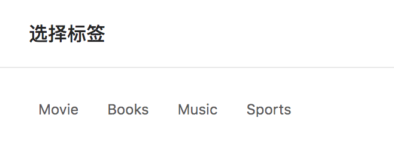

# 添加组件

不管使用什么框架，我们都绕不开组件。很多入门阶段的同学对认为只有需要功能复用才分离成组件，在组件规划上 [关注点分离](https://zh.wikipedia.org/wiki/%E5%85%B3%E6%B3%A8%E7%82%B9%E5%88%86%E7%A6%BB) 应该我们首要考虑的目标。一个复杂的页面上通常包含多个业务逻辑。我们应该根据逻辑的复杂度和业务的关联性来进行组件拆分。这样我们在开发和今后维护时，只需要关注一小部分，而不至于担心其他逻辑。下面我们根据这个原则将来创建项目的组件：

- 用户面板
- 标签筛选
- 搜索框
- 项目列表

## 用户面板

命令行输入以下命令生成一个空白的组件：

```base
ng g c user-panel # 生成 src/app/user-panel
```

在 `layout` 组件用户面板位置添加如下代码。

**layout.component.html**

```html
...
<div class="user-pane-wrap">
  <app-user-panel></app-user-panel>
</div>
...
```

接下来我们给组件添加一个 `nz-avatar` 组件用于显示用户头像；一个 class 为 `username` 部分显示用户名；最后添加一个带状态控制的按钮，用于添加或切换用户。

 **user-panel.component.html**
 
```html
<nz-avatar nzIcon="anticon anticon-user"></nz-avatar>
<div class="username">用户名</div>
<div class="add-user">
  <a *ngIf="false">添加用户</a>
  <a>切换</a>
</div>
```

编写样式文件，其中 `:host` 是指当前组件。为了避免用户名过长，我们让它超出隐藏。

 **user-panel.component.less**
 
```less
:host {
  display: flex;
  justify-content: flex-start;
  align-items: center;

  .username {
    margin: 0 10px;
    color: #595959;
    font-weight: 500;
    max-width: 200px;
    overflow: hidden;
    text-overflow: ellipsis;
    white-space: nowrap;
  }
}
```
 
## 搜索框

然后输入一下命令生成一个带前缀图标以及清除按钮的搜索框组件：

```base
ng g ng-zorro-antd:input-presuffix -p app --styleext='less' --name=search-bar # 生成 src/app/search-bar
```

和之前一样在 `layout` 组件预留的位置中添加该组件。

**layout.component.html**

```html
...
<div class="search-bar-wrap">
  <app-search-bar></app-search-bar>
</div>
...
```

接下来我们修改一下前缀图标及默认文字。

这里我们的 `ngModel` 使用单向绑定，手动的处理 `(ngModelChange)` 以便向外发出搜索事件。

**search-bar.component.html**

```html
<nz-input-group [nzSuffix]="suffixTemplate" nzPrefixIcon="anticon anticon-search">
  <input class="search-input" type="text" nz-input placeholder="搜索仓库" [nzSize]="'large'" [ngModel]="term" (ngModelChange)="onSearch($event)">
</nz-input-group>
<ng-template #suffixTemplate><i class="anticon anticon-close-circle" (click)="onClear()" *ngIf="term"></i>
</ng-template>
```

在 ts 文件中添加处理搜索和清除的对应代码。

**search-bar.component.ts**

我们使用 `@Output` 声明两个输出事件，用于与父组件通讯。

```ts
import { Component, EventEmitter, Output } from '@angular/core';

@Component({
  selector: 'app-search-bar',
  templateUrl: './search-bar.component.html',
  styleUrls: ['./search-bar.component.less']
})
export class SearchBarComponent {
  term: string;

  @Output() search = new EventEmitter<string>();
  @Output() clear = new EventEmitter<void>();

  onClear(): void{
    this.term = null;
    this.clear.emit()
  }

  onSearch(value: string): void {
    this.term = value;
    this.search.emit(value);
  }
}
```

然后我们修改输入框的默认样式，去掉边框。

**search-bar.component.less**

```less
.search-input {
  border: none;
  &:focus {
    box-shadow: none;
  }
}

.anticon-close-circle {
  cursor: pointer;
  color: #ccc;
  transition: color 0.3s;
  font-size: 12px;
}

.anticon-close-circle:hover {
  color: #999;
}

.anticon-close-circle:active {
  color: #666;
}
```

现在我们的头部应该像下面这样


我们的头部组件已经完成，下面我们来编写侧边栏的标签筛选组件。

## 标签筛选

在命令行输入一下命令，生成一个可选标签组件：

```base
ng g ng-zorro-antd:tag-hot-tags -p app --styleext='less' --name=tags-filter
```

将生成的组件放在侧边栏的位置

**layout.component.html**

```html
<nz-sider [nzWidth]="350" class="side">
  <div class="tags-wrap">
    <app-tags-filter></app-tags-filter>
  </div>
</nz-sider>
```


接下来我们将 html 内容放入一个 `nz-card` 组件中。

`nz-card` 是一个卡片容器组件，允许我们设置标题、操作按钮以及内容。

**tags-filter.component.html**

```html
<nz-card [nzBordered]="false" nzTitle="选择标签">
  <nz-tag *ngFor="let tag of hotTags" nzMode="checkable"
          [nzChecked]="selectedTags.indexOf(tag) > -1" (nzCheckedChange)="handleChange($event, tag)">
    {{ tag }}
  </nz-tag>
</nz-card>
```

现在刷新你的页面，你会看到下面的样子



现在试着修改一下 `ts` 文件里的 `tagsFromServer` 变量，为他多增减几个标签。你会发现样式显得有些拥挤。

现在修改我们组件的样式文件。由于 NG-ZORRO 组件视图封装模式使用的是模拟 `Shadow DOM` 来保证各组件样式不会互相影响。因此使用 `::ng-deep` 来达到穿透组件的效果来修改组件内部样式。感兴趣的同学可以参考 [Angular 文档(组件样式)](https://angular.cn/guide/component-styles#deprecated-codedeepcode-codecode-and-codeng-deepcode)。

**tags-filter.component.less**

```less
::ng-deep .ant-tag {
  margin-bottom: 8px;
}
```

接下来为我们的组件添加一个 `tags` 输入属性作为要显示的标签，一个 `select` 输出属性向外传递选择事件。修改下面的文件。

**tags-filter.component.ts**

```ts
import { Component, EventEmitter, Input, Output } from '@angular/core';

@Component({
  selector: 'app-tags-filter',
  templateUrl: './tags-filter.component.html',
  styleUrls: ['./tags-filter.component.less']
})
export class tagsFilterComponent {

  selectedTags = [];

  @Input() tags: string[] = [];
  @Output() select = new EventEmitter<string[]>();

  handleChange(checked: boolean, tag: string): void {
    if (checked) {
      this.selectedTags.push(tag);
    } else {
      this.selectedTags = this.selectedTags.filter(t => t !== tag);
    }
    this.select.emit(this.selectedTags);
  }
}
```

**tags-filter.component.html**

```html
<nz-card [nzBordered]="false" nzTitle="选择标签">
  <nz-tag *ngFor="let tag of tags" nzMode="checkable"
          [nzChecked]="selectedTags.indexOf(tag) > -1" (nzCheckedChange)="handleChange($event, tag)">
    {{ tag }}
  </nz-tag>
</nz-card>
```

## 项目列表

在命令行输入一下命令，生成一个列表组件。

```base
ng g c item-list
```

将组件放置 `layout` 组件预留的位置中。

```html
...
<div class="item-list-wrap">
  <app-item-list></app-item-list>
</div>
...
```

然后编辑以下文件：

**item-list.component.html**

```html
<ul class="list">
  <li class="item">
    <div class="title-wrap">
      <nz-avatar class="avatar" nzIcon="anticon anticon-user" [nzSrc]=""></nz-avatar>
      <h4 class="title"><a>ng-zorro-antd</a> &nbsp; <small><i class="anticon anticon-star"></i> 3147 </small></h4>
      <!--tags-->
    </div>
    <p class="description">An enterprise-class UI components based on Ant Design and Angular. 🐜</p>
  </li>
</ul>
```
**item-list.component.less**

```less
ul.list {
  list-style-type: none;
  padding: 10px 20px;
  min-height: 100px;

  li.item {
    border-bottom: 1px solid #e8e8e8;
    margin-bottom: 15px;

    .title-wrap {
      display: flex;
      align-items: center;
      height: 36px;

      h4 {
        margin: 0 10px;
      }
    }

    .description {
      color: #949494;
      margin: 8px 0;
    }
  }

}
```

之后我们会为下面列表添加动态增减标签的功能，不过那得等到我们成功从 API 获取数据之后了。

现在我们的应用应该像这样：


## 小结

在这一小结我们完成了应用所需组件的初始化工作，为它们添加了一些必要的属性和样式，还体验了一些命令行工具来快速生成组件。接下让我们编写服务获取服务器数据。
