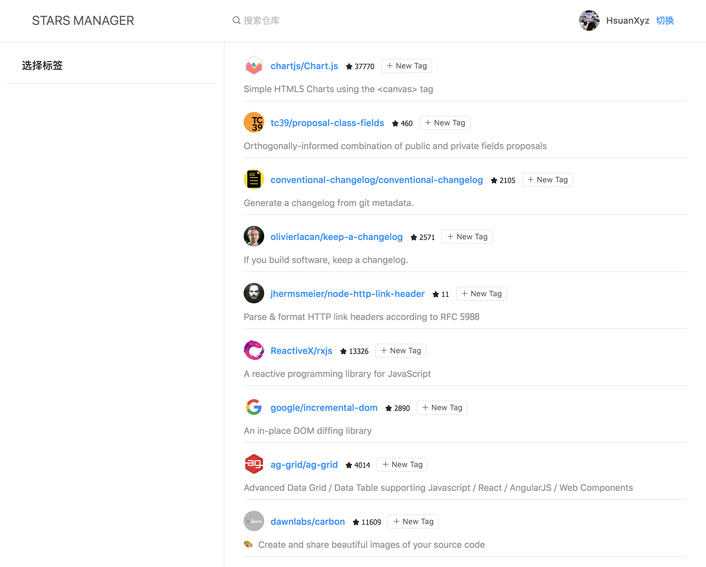

# 标签管理

## 为每个库添加标签组件

这里我们要为每一个 item 添加一个增删标签的组件，在命令后输入以下命令(注意: 这里使用 `--path` 参数指的了组件路径):

```base
$ ng g ng-zorro-antd:tag-control -p app --styleext='less' --name=item-tags --path=src/app/components
```

接下来修改组件，为其然增加一个 `id` 输入属性，用于控制这个 repo 的 tags。然后修改以下生成模板中的条件判断

**item-tags.component.ts**

```ts
import { Component, ElementRef, Input, ViewChild } from '@angular/core';

@Component({
  selector: 'app-item-tags',
  templateUrl: './item-tags.component.html',
  styleUrls: ['./item-tags.component.less'],
})
export class ItemTagsComponent {

  tags = [];
  inputVisible = false;
  inputValue = '';
  @Input() id: number;
  @ViewChild('inputElement') inputElement: ElementRef;

  handleClose(removedTag: {}): void {
    this.tags = this.tags.filter(tag => tag !== removedTag);
  }

  sliceTagName(tag: string): string {
    const isLongTag = tag.length > 20;
    return isLongTag ? `${tag.slice(0, 20)}...` : tag;
  }

  showInput(): void {
    this.inputVisible = true;
    setTimeout(() => {
      this.inputElement.nativeElement.focus();
    }, 10);
  }

  handleInputConfirm(): void {
    if (this.inputValue && this.tags.indexOf(this.inputValue) === -1) {
      this.tags.push(this.inputValue);
    }
    this.inputValue = '';
    this.inputVisible = false;
  }
}
```

**item-tags.component.html**

```html
<nz-tag
  *ngFor="let tag of tags"
  [nzMode]="'closeable'"
  (nzAfterClose)="handleClose(tag)">
  {{ sliceTagName(tag) }}
</nz-tag>
<nz-tag
  *ngIf="!inputVisible"
  class="editable-tag"
  (click)="showInput()">
  <i class="anticon anticon-plus"></i> New Tag
</nz-tag>
<input
  #inputElement
  nz-input
  nzSize="small"
  *ngIf="inputVisible" type="text"
  [(ngModel)]="inputValue"
  style="width: 78px;"
  (blur)="handleInputConfirm()"
  (keydown.enter)="handleInputConfirm()">
```

调整样式

**item-tags.component.less**

```less
.editable-tag ::ng-deep .ant-tag {
  background: rgb(255, 255, 255);
  border-style: dashed;
}

::ng-deep .ant-tag {
  margin-bottom: 0;
}
```

将其放入 `ItemListComponent` 组件的模板循环体中，然后将 `id` 属性传给标签组件。

**item-list.component.html**

```html
<nz-spin nzTip='Loading...' [nzSpinning]="loading">
  <ul class="list">
    <li class="item" *ngFor="let item of data">
      <div class="title-wrap">
        <nz-avatar class="avatar" nzIcon="anticon anticon-user" [nzSrc]="item.owner.avatar_url"></nz-avatar>
        <h4 class="title">
          <a [href]="item.html_url" target="_blank">{{item.full_name}}</a> &nbsp;
          <small><i class="anticon anticon-star"></i> {{item.stargazers_count}}</small>
        </h4>
        <app-item-tags [id]="item.id"></app-item-tags>
      </div>
      <p class="description">{{item.description}}</p>
    </li>
  </ul>
</nz-spin>
```

不出意外的话，你的界面应该像下面这样。



你现在可以尝试点击 `New Tag` 按钮增加标签，当然，现在只实现了交互效果，并没有实质性的作用。

接下来我们会编写标签服务来控制标签的增删查，最后会在添加通过标签筛选的功能。

## 标签管理服务

这里我们会使用本地储存来管理用户自定义标签，当然免不了设计存储的数据结构。所以和之前一样，我们需要为其声明 Interface。

在命令行输入以下命令，并编写以下文件内容：

```base
$ ng g interface interfaces/repo-tags
```

**repo-tags.ts**

```
export interface RepoTags {
  repos: Repos;
  tags: Tag[];
}

export interface Repos {
  [id: number]: string[];
}

export interface Tag {
  name: string;
  repos: number[];
  count: number;
}
```

这里的 `repos` 属性和 `tags` 属性其实是互相映射的关系。这里我们是在用空间换时间，因为在数据量很大的时候，特别是在 Angular 模板的循环体中反查对应数据是消耗性能的。没明白的同学等我们做完之后再慢慢体会。

### 创建标签管理服务

这里我们会使用 [localForage](https://github.com/localForage/localForage) 来操作本地存储，它会自动的根据浏览器支持选择 `IndexedDB` > `WebSQL` > `localStorage` 作为存储方案。这里我们是希望通过 `IndexedDB` 的异步存取来改善性能，而使用 `localForage` 时，它的用法几乎与使用 `localStorage` 一样。

在命令输入 `npm install localforage` 安装，然后在 `app.module.ts` 中调用 `localforage.config` 方法配置存储前缀，这是有效避免命名冲突的最佳实践。

**app.module.ts**

```ts
...
import localForage from "localforage";

localForage.config({
  name: 'nz-stars',
  storeName: 'nz-stars'
});
```

接下来在命令行输入以下命令创建标签服务：


```base
ng g s services/tags
```

然后为其添加如下方法:

**tags.service.ts**

```ts
import { Injectable } from '@angular/core';

import localForage from "localforage";

import { AuthService } from './auth.service';
import { RepoTags } from "../interfaces/repo-tags";

import { Subject } from 'rxjs/internal/Subject';

@Injectable({
  providedIn: 'root'
})
export class TagsService {

  tagsCache: {
    tags: RepoTags,
    username: string
  };

  tagChange = new Subject<RepoTags>();

  get hasCache(): boolean {
    return this.tagsCache && this.tagsCache.username === this.authService.username
  }

  constructor(private authService: AuthService) {
  }


  getTags(): Promise<RepoTags> {
    const username = this.authService.username;

    // 如果有缓存则使用缓存
    if (this.hasCache) {
      return Promise.resolve(this.tagsCache.tags);
    }

    return localForage.getItem(`{${username}/tags`)
    .then((tags: RepoTags) => {
      this.tagsCache = {
        tags,
        username
      };
      return Promise.resolve(tags);
    })
  }

  addTag(tag: string, repoId: number) {
    const username = this.authService.username;
    return this.getTags().then(tags => {
      const newTags: RepoTags = tags ? tags : { repos: {}, tags: [] };
      const tagIndex = newTags.tags.findIndex(item => item.name === tag);

      if (newTags.repos[repoId]) {
        newTags.repos[repoId].push(tag);
      } else {
        newTags.repos[repoId] = [tag];
      }

      if (tagIndex !== -1) {
        newTags.tags[tagIndex].repos.push(repoId);
        newTags.tags[tagIndex].count = newTags.tags[tagIndex].repos.length;
      } else {
        newTags.tags.push({
          name: tag,
          repos: [repoId],
          count: 1
        })
      }
      this.tagsCache = {
        tags: newTags,
        username
      };
      this.tagChange.next(newTags);
      return localForage.setItem(`{${username}/tags`, newTags);
    })
  }

  removeTag(tag: string, repoId: number) {
    const username = this.authService.username;
    return this.getTags().then(tags => {
      const newTags: RepoTags = tags ? tags : { repos: {}, tags: [] };
      const tagIndex = newTags.tags.findIndex(item => item.name === tag);

      if (newTags.repos[repoId]) {
        const tagIndexInRepo = newTags.repos[repoId].indexOf(tag);
        newTags.repos[repoId].splice(tagIndexInRepo, tagIndexInRepo !== -1 ? 1 : 0);
      } else {
        newTags.repos[repoId] = [];
      }

      if (tagIndex !== -1) {
        const repoIndexInTag = newTags.tags[tagIndex].repos.indexOf(repoId);
        const count = newTags.tags[tagIndex].count;

        if (newTags.tags.length === 1 && repoIndexInTag !== -1) {
          // 如果这是唯一一个 tag 则直接移除它。
          newTags.tags.splice(repoIndexInTag, 1);
        } else if (repoIndexInTag !== -1) {
          newTags.tags[tagIndex].repos.splice(repoIndexInTag, 1);
          newTags.tags[tagIndex].count = newTags.tags[tagIndex].repos.length;
        }
      }

      this.tagsCache = {
        tags: newTags,
        username
      };
      
      this.tagChange.next(newTags);
      return localForage.setItem(`{${username}/tags`, newTags);
    })
  }

}
```

这里有几点需要注意：

* 使用了当前用户作为存储 key 的前缀，用于区分不同用户的自定义标签；
* 在第一次获取，以及发生改动后都对数据进行了内存缓存，这比每次读取本地存储快得多。
* 每次发生改动后调用了 `tagChange` 进行广播，方便相关组件刷新数据。

## 绑定标签

修改 `ItemTagsComponent` 组件，将 `tags` 属性作为输入属性。
同时将组件的 `changeDetection` 设置为 `ChangeDetectionStrategy.OnPush` 以此提高性能。最后在 `handleInputConfirm` 和 `handleClose` 方法中调用 `TagsService` 的对于方法。

**item-tags.component.ts**

```ts
import { ChangeDetectionStrategy, Component, ElementRef, Input, ViewChild } from '@angular/core';
import { TagsService } from '../../services/tags.service';

@Component({
  selector       : 'app-item-tags',
  templateUrl    : './item-tags.component.html',
  styleUrls      : [ './item-tags.component.less' ],
  changeDetection: ChangeDetectionStrategy.OnPush
})
export class ItemTagsComponent {

  inputVisible = false;
  inputValue = '';
  @Input() id: number;
  @Input() tags: string[] = [];

  @ViewChild('inputElement') inputElement: ElementRef;

  constructor(private tagsService: TagsService) {

  }

  handleClose(removedTag: string): void {
    this.tagsService.removeTag(removedTag, this.id)
    .then(() => {
      this.tags = this.tags.filter(tag => tag !== removedTag);
    });
  }

  sliceTagName(tag: string): string {
    const isLongTag = tag.length > 20;
    return isLongTag ? `${tag.slice(0, 20)}...` : tag;
  }

  showInput(): void {
    this.inputVisible = true;
    setTimeout(() => {
      this.inputElement.nativeElement.focus();
    }, 10);
  }

  handleInputConfirm(): void {
    if (this.inputValue && this.tags.indexOf(this.inputValue) === -1) {
      this.tagsService.addTag(this.inputValue, this.id)
      .then(() => {
        this.tags.push(this.inputValue);
      });
    }
    this.inputValue = '';
    this.inputVisible = false;
  }
}
```

然后修改 `ItemListComponent` 组件的 `getStarredRepo` 方法，在获取数据后调用数组 `map` 方法，将对于标签添加到数据中，同时修改 `data` 属性的类型，为其添加 `tags` 属性。

**item-list.component.ts**

```ts
```

